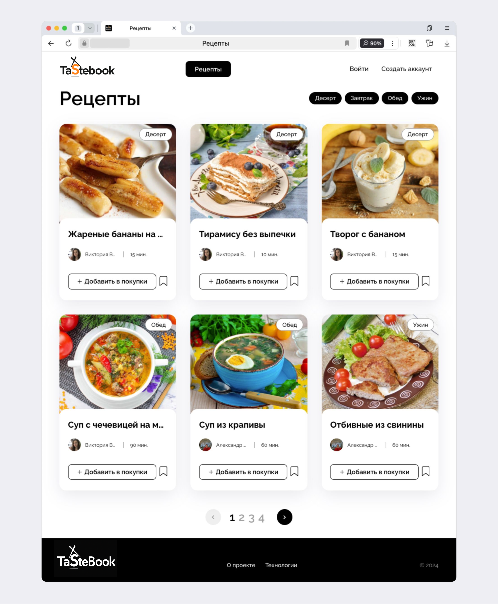

# TasteBook


**TasteBook** — это веб-приложение для публикации и обмена рецептами. Пользователи могут публиковать свои рецепты, добавлять чужие рецепты в избранное и подписываться на публикации других авторов. Зарегистрированным пользователям также будет доступен сервис «Список покупок». Он позволит создавать список продуктов, которые нужно купить для приготовления выбранных блюд. 



## Возможности проекта

### Страницы и функционал:
- **Главная страница**:
  - Отображаются первые шесть рецептов, отсортированных по дате (от новых к старым).
  - Реализована постраничная пагинация для дальнейших рецептов.
  
- **Страница регистрации**:
  - Необходимые поля: имя, фамилия, никнейм, электронная почта и пароль.
  
- **Страница входа**:
  - Доступна после успешной регистрации для входа в систему.

- **Статические страницы**:
  - «О проекте» и «Технологии».

- **Страница рецепта**:
  - Полное описание рецепта.
  - Возможность добавить рецепт в избранное, в список покупок и подписаться на автора.
  - Короткая ссылка на рецепт для быстрого обмена.

- **Страница пользователя**:
  - Имя пользователя и все его рецепты.
  - Кнопка для подписки или отписки от этого пользователя.

- **Страница подписок**:
  - Пользователь может подписываться на рецепты других авторов.
  - Доступна только для владельца аккаунта, отображает список подписанных пользователей и их рецепты.

- **Избранное**:
  - Добавление рецептов в избранное.
  - Список избранных рецептов доступен только владельцу аккаунта.

- **Список покупок**:
  - Создание списка продуктов для рецептов.
  - Возможность скачать список покупок в формате `.csv`.

- **Создание и редактирование рецепта**:
  - Доступно только для авторизованных пользователей.
  - Все поля обязательны для заполнения.

- **Страница смены пароля**:
  - Изменение пароля доступно только для авторизованных пользователей.

- **Фильтрация по тегам**:
  - Рецепты можно фильтровать по тегам.
  - Фильтрация осуществляется по комбинации нескольких тегов.

- **Смена аватара**:
  - После регистрации пользователю предоставляется изображение профиля по умолчанию, которое можно заменить или удалить.

## Установка

### Чтобы развернуть проект локально, выполните следующие шаги:

1. Клонируйте репозиторий:
   ```bash
   git clone https://github.com/ShiroyashaSG/tastebook.git
   ```
2. Перейдите в директорию проекта:
   ```bash
   cd tastebook
   ```
3. Cоздайте и активируйте виртуальное окружение:
   ```bash
   py -3.9 -m venv venv
   source venv\Scripts\activate  # Для Linux: venv/bin/activate
   ```
4. Установите зависимости из файла requirements.txt:
   ```bash
   python -m pip install --upgrade pip
   pip install -r requirements.txt
   ```
5. Создайте миграции:
   ```bash
   python manage.py makemigrations
   ```
6. Примените миграции:
   ```bash
   python manage.py migrate
   ```
7. Загрузите данные из csv - файлов в базу данных:
   ```bash
   python manage.py import_data
   ```
8. Запустите сервер:
   ```bash
   python manage.py runserver
   ```

### Чтобы развернуть проект на сервере:
1. Установить docker на сервер (Linux):
    ```bash
    sudo apt update
    sudo apt install curl
    curl -fSL https://get.docker.com -o get-docker.sh 
    sudo sh ./get-docker.sh
    ```
2. Установить докер docker-compose:
    ```bash
    sudo apt install docker-compose-plugin
    sudo systemctl status docker
    ```
3. Установить nginx:
    ```bash
    sudo apt install nginx -y
    sudo systemctl start nginx
    ```
4. Настроить nginx:
    ```bash
    sudo nano /etc/nginx/sites-enabled/default
    sudo nginx -t
    sudo systemctl reload nginx
    ```
5. Создать директорию проекта и добавить .env:
    ```bash
    mkdir tastebook && cd tastebook/
    nano .env
    ```
    Пример .env:
    ```
    SECRET_KEY=<Your_django_secret_key>
    DEBUG=<debug>
    ALLOWED_HOSTS=<Your_host>
    POSTGRES_DB=<db_name>
    POSTGRES_USER=<db_user>
    POSTGRES_PASSWORD=<db_pass>
    DB_NAME=<db_name>
    DB_HOST=<db_host>
    DB_PORT=5432
    ```
6. Скопировать в директорию проекта папки data, docs и docker-compose.yml файл:
    ```bash
    scp -r data/* docs/* docker-compose.yml <server user>@<server IP>:/home/<server user>/tastebook/
    ```
7. Выполнить сборку статики:
    ```bash
    sudo docker compose -f docker-compose.yml pull
    sudo docker compose -f docker-compose.yml down
    sudo docker compose -f docker-compose.yml up -d
    sudo docker compose -f docker-compose.yml exec backend python manage.py migrate
    sudo docker compose -f docker-compose.yml exec backend python manage.py collectstatic
    sudo docker compose -f docker-compose.yml exec backend cp -r /app/collected_static/. /backend_static/static/
    ```
8. Создать суперпользователя:
    ```bash
    sudo docker compose -f docker-compose.yml exec backend python manage.py createsuperuser
    ```
9. Импортировать ингредиенты:
    ```bash
    sudo docker compose -f docker-compose.yml exec backend python manage.py import_data
    ```

## Примеры запросов к API

### Регистрация пользователя
***POST*** запрос на **/api/users/**

_Тело запроса:_
```json
{
  "email": "vpupkin@yandex.ru",
  "username": "vasya.pupkin",
  "first_name": "Вася",
  "last_name": "Иванов",
  "password": "Qwerty123"
}
```

_Ответ:_
```json
{
  "email": "vpupkin@yandex.ru",
  "id": 0,
  "username": "vasya.pupkin",
  "first_name": "Вася",
  "last_name": "Иванов"
}
```

### Получение списка рецептов
***GET*** запрос на **/api/recipes/**

_Ответ:_
```json
{
  "count": 123,
  "next": "http://tastebook.example.org/api/recipes/?page=4",
  "previous": "http://tastebook.example.org/api/recipes/?page=2",
  "results": [
    {
      "id": 0,
      "tags": [
        {
          "id": 0,
          "name": "Завтрак",
          "slug": "breakfast"
        }
      ],
      "author": {
        "email": "user@example.com",
        "id": 0,
        "username": "string",
        "first_name": "Вася",
        "last_name": "Иванов",
        "is_subscribed": false,
        "avatar": "http://tastebook.example.org/media/users/image.png"
      },
      "ingredients": [
        {
          "id": 0,
          "name": "Картофель отварной",
          "measurement_unit": "г",
          "amount": 1
        }
      ],
      "is_favorited": true,
      "is_in_shopping_cart": true,
      "name": "string",
      "image": "http://tastebook.example.org/media/recipes/images/image.png",
      "text": "string",
      "cooking_time": 1
    }
  ]
}
```

### Создание рецепта
***POST*** запрос на **/api/recipes/**

_Тело запроса:_
```json
{
  "ingredients": [
    {
      "id": 1123,
      "amount": 10
    }
  ],
  "tags": [
    1,
    2
  ],
  "image": "data:image/png;base64,iVBORw0KGgoAAAANSUhEUgAAAAEAAAABAgMAAABieywaAAAACVBMVEUAAAD///9fX1/S0ecCAAAACXBIWXMAAA7EAAAOxAGVKw4bAAAACklEQVQImWNoAAAAggCByxOyYQAAAABJRU5ErkJggg==",
  "name": "string",
  "text": "string",
  "cooking_time": 1
}
```

_Ответ:_
```json
{
  "id": 0,
  "tags": [
    {
      "id": 0,
      "name": "Завтрак",
      "slug": "breakfast"
    }
  ],
  "author": {
    "email": "user@example.com",
    "id": 0,
    "username": "string",
    "first_name": "Вася",
    "last_name": "Иванов",
    "is_subscribed": false,
    "avatar": "http://tastebook.example.org/media/users/image.png"
  },
  "ingredients": [
    {
      "id": 0,
      "name": "Картофель отварной",
      "measurement_unit": "г",
      "amount": 1
    }
  ],
  "is_favorited": true,
  "is_in_shopping_cart": true,
  "name": "string",
  "image": "http://tastebook.example.org/media/recipes/images/image.png",
  "text": "string",
  "cooking_time": 1
}
```

### Получение рецепта
***GET*** запрос на **/api/recipes/{id}/**

_Ответ:_
```json
{
  "id": 0,
  "tags": [
    {
      "id": 0,
      "name": "Завтрак",
      "slug": "breakfast"
    }
  ],
  "author": {
    "email": "user@example.com",
    "id": 0,
    "username": "string",
    "first_name": "Вася",
    "last_name": "Иванов",
    "is_subscribed": false,
    "avatar": "http://tastebook.example.org/media/users/image.png"
  },
  "ingredients": [
    {
      "id": 0,
      "name": "Картофель отварной",
      "measurement_unit": "г",
      "amount": 1
    }
  ],
  "is_favorited": true,
  "is_in_shopping_cart": true,
  "name": "string",
  "image": "http://tastebook.example.org/media/recipes/images/image.png",
  "text": "string",
  "cooking_time": 1
}
```

### Обновление рецепта
***PATCH*** запрос на **/api/recipes/{id}/**

_Тело запроса:_
```json
{
  "ingredients": [
    {
      "id": 1123,
      "amount": 10
    }
  ],
  "tags": [
    1,
    2
  ],
  "image": "data:image/png;base64,iVBORw0KGgoAAAANSUhEUgAAAAEAAAABAgMAAABieywaAAAACVBMVEUAAAD///9fX1/S0ecCAAAACXBIWXMAAA7EAAAOxAGVKw4bAAAACklEQVQImWNoAAAAggCByxOyYQAAAABJRU5ErkJggg==",
  "name": "string",
  "text": "string",
  "cooking_time": 1
}
```

_Ответ:_
```json
{
  "id": 0,
  "tags": [
    {
      "id": 0,
      "name": "Завтрак",
      "slug": "breakfast"
    }
  ],
  "author": {
    "email": "user@example.com",
    "id": 0,
    "username": "string",
    "first_name": "Вася",
    "last_name": "Иванов",
    "is_subscribed": false,
    "avatar": "http://tastebook.example.org/media/users/image.png"
  },
  "ingredients": [
    {
      "id": 0,
      "name": "Картофель отварной",
      "measurement_unit": "г",
      "amount": 1
    }
  ],
  "is_favorited": true,
  "is_in_shopping_cart": true,
  "name": "string",
  "image": "http://tastebook.example.org/media/recipes/images/image.png",
  "text": "string",
  "cooking_time": 1
}
```

### Получить короткую ссылку на рецепт
***GET*** запрос на **/api/recipes/{id}/get-link/**

_Ответ:_
```json
{
"short-link": "https://tastebook.example.org/s/3d0"
}
```

### Подписаться на пользователя
***POST*** запрос на **/api/users/{id}/subscribe/**

_Ответ:_
```json
{
  "email": "user@example.com",
  "id": 0,
  "username": "string",
  "first_name": "Вася",
  "last_name": "Иванов",
  "is_subscribed": true,
  "recipes": [
    {
      "id": 0,
      "name": "string",
      "image": "http://tastebook.example.org/media/recipes/images/image.png",
      "cooking_time": 1
    }
  ],
  "recipes_count": 0,
  "avatar": "http://tastebook.example.org/media/users/image.png"
}
```

## Технологии

Проект построен с использованием следующих технологий:
- **Python 3.9.0**
- **Django**
- **Django REST Framework**
- **PostgreSQL**
- **React**
- **Docker** 
- **CI/CD (GitHub Actions)**

## Лицензия
Проект лицензирован под лицензией `MIT`.
